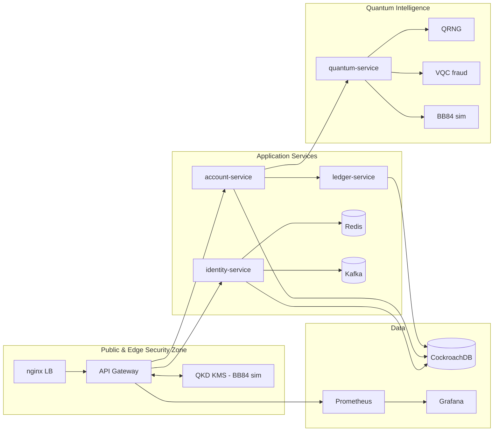

# 🏦 Quantum Banking System

> **Hybrid quantum-classical banking platform** — combining quantum randomness, quantum key distribution, and variational quantum classifiers with classical microservices for next-generation financial security.

[](https://github.com/raghe-d78/quantum-banking-system/actions/workflows/ci.yml)
[](https://github.com/raghe-d78/quantum-banking-system/actions/workflows/quantum-ci.yml)

---

## Overview

The Quantum Banking System is a research-grade, containerised microservice platform that integrates **Qiskit-based quantum computing** components with classical Node.js banking services. It demonstrates:

- **Quantum Random Number Generation (QRNG)** for cryptographically strong entropy.
- **BB84 Quantum Key Distribution (QKD)** simulation for quantum-safe key exchange.
- **Variational Quantum Classifier (VQC)** for AI-powered fraud detection.
- **Classical banking services** (identity, accounts, ledger, API gateway) built on Node.js + CockroachDB.
- **Full observability stack** with Prometheus + Grafana.

> ⚠️ The quantum components use Qiskit Aer simulation — not real quantum hardware. See [`docs/quantum/`](docs/quantum/) for details.

---

## Architecture

### Four-Zone Design

```
┌─────────────────────────────────────────────────────────────────────────┐
│  Zone 1 — Public & Edge Security                                         │
│  nginx (rate-limit + reverse proxy)  ──→  API Gateway (:3000)            │
│                                          │         ↕                     │
│                                       QKD-KMS (:8001)  [BB84-sim]        │
└─────────────────────────────────────────────────────────────────────────┘
┌─────────────────────────────────────────────────────────────────────────┐
│  Zone 2 — Application Services                                           │
│  identity-service (:3001)  account-service (:3002)  ledger-service       │
│  ↕ Redis (:6379)           ↕ Kafka (:9092)                               │
└─────────────────────────────────────────────────────────────────────────┘
┌─────────────────────────────────────────────────────────────────────────┐
│  Zone 3 — Quantum Intelligence                                           │
│  quantum-service (:8000) → QRNG / BB84 / VQC fraud detection            │
└─────────────────────────────────────────────────────────────────────────┘
┌─────────────────────────────────────────────────────────────────────────┐
│  Zone 4 — Data                                                           │
│  CockroachDB (:26257)  Prometheus (:9090)  Grafana (:3030)               │
└─────────────────────────────────────────────────────────────────────────┘
```

### Mermaid Diagram



---

## Quick Start

### Prerequisites

- Docker ≥ 24 and Docker Compose v2
- `make`

### Run all services

```bash
# Production-like stack
make up

# Development mode (hot-reload for all services)
make dev

# Quantum services only
make quantum   # quantum-service on :8000
make qkd       # qkd-kms on :8001

# Infrastructure services only (Redis, Kafka, Prometheus, Grafana, nginx)
make infra
```

### Service Ports

| Service           | Port  | Notes                           |
|-------------------|-------|---------------------------------|
| nginx             | 80    | Reverse proxy / rate limiter    |
| api-gateway       | 3000  | REST gateway (Node.js)          |
| identity-service  | 3001  | Auth & user management          |
| account-service   | 3002  | Account CRUD                    |
| ledger-service    | 3003  | Transaction ledger              |
| quantum-service   | 8000  | QRNG / BB84 / VQC (FastAPI)     |
| qkd-kms           | 8001  | QKD key management (FastAPI)    |
| CockroachDB       | 26257 | Distributed SQL                 |
| CockroachDB UI    | 8080  | Web admin console               |
| Redis             | 6379  | Cache / session store           |
| Kafka             | 9092  | Event streaming                 |
| Prometheus        | 9090  | Metrics collection              |
| Grafana           | 3030  | Observability dashboards        |

---

## Quantum Logic — Mathematical Foundations

### 1. Qubit & Superposition

A qubit state is described by:

$$|\psi\rangle = \alpha|0\rangle + \beta|1\rangle$$

where $\alpha, \beta \in \mathbb{C}$ satisfy the normalisation constraint $|\alpha|^2 + |\beta|^2 = 1$.

The Bloch sphere provides a geometric representation of all single-qubit pure states:


*Bloch sphere — geometric representation of a qubit state. [Wikimedia Commons, CC BY-SA 3.0](https://commons.wikimedia.org/wiki/File:Bloch_sphere.svg)*

---

### 2. Hadamard Gate & QRNG

The Hadamard gate is defined by the matrix:

$$H = \frac{1}{\sqrt{2}}\begin{pmatrix}1 & 1\\ 1 & -1\end{pmatrix}$$

Applied to the ground state $|0\rangle$:

$$H|0\rangle = \frac{|0\rangle + |1\rangle}{\sqrt{2}} \equiv |{+}\rangle$$

This is the equal superposition state. The **Born rule** gives measurement probabilities:

$$P(x) = |\langle x|\psi\rangle|^2$$

so $P(0) = P(1) = \frac{1}{2}$ — exactly 1 bit of entropy per qubit.

The `quantum-service` QRNG (`GET /v1/qrng`) generates $n$ bits by applying $H$ to $n$ qubits in $|0\rangle$ and measuring, yielding true quantum randomness.


*Hadamard gate circuit symbol. [Wikimedia Commons, public domain](https://commons.wikimedia.org/wiki/File:Hadamard_gate.svg)*

---

### 3. BB84 Quantum Key Distribution

BB84 (Bennett & Brassard, 1984) is the first provably-secure QKD protocol.

#### Encoding table

| Basis | Bit 0    | Bit 1    |
|-------|----------|----------|
| Z (rectilinear) | $|0\rangle$ | $|1\rangle$ |
| X (diagonal)    | $|{+}\rangle$ | $|{-}\rangle$ |

#### Protocol steps

1. **Alice** generates $n$ random bits and $n$ random bases ($Z$ or $X$).
2. **Alice encodes** each bit into the corresponding quantum state.
3. **Bob** measures each qubit in a randomly chosen basis.
4. **Sifting**: Alice and Bob publicly compare bases; only matching positions are kept.
5. **QBER estimation**: a sample of the sifted key is compared:

$$\text{QBER} = \frac{\text{errors}}{\text{sifted bits sampled}}$$

If $\text{QBER} > 11\%$, eavesdropping is flagged.

#### Security guarantee — No-Cloning Theorem

> **No-Cloning Theorem**: There is no unitary operation $U$ such that $U|\psi\rangle|0\rangle = |\psi\rangle|\psi\rangle$ for all $|\psi\rangle$.

An eavesdropper (Eve) who intercepts qubits must measure them, inevitably disturbing the state. With each intercepted qubit, the probability of Eve *not* being detected after $k$ check bits is:

$$P(\text{undetected}) = \left(\frac{3}{4}\right)^k$$

For $k = 100$, this is $\approx 3 \times 10^{-13}$.


*BB84 protocol diagram. [Wikimedia Commons, CC BY-SA 3.0](https://commons.wikimedia.org/wiki/File:BB84.svg)*

See [`docs/quantum/bb84.md`](docs/quantum/bb84.md) for the full security analysis.

---

### 4. Variational Quantum Classifier (VQC)

The VQC for fraud detection uses three components:

1. **Feature map** $\Phi(\mathbf{x})$: encodes classical features into quantum amplitudes via `ZZFeatureMap`.
2. **Parameterised ansatz** $U(\boldsymbol{\theta})$: `RealAmplitudes` circuit whose parameters are optimised.
3. **Prediction**: expectation value of $Z^{\otimes n}$:

$$\hat{y} = \langle 0^n | U^\dagger(\boldsymbol{\theta})\,\Phi^\dagger(\mathbf{x})\; Z \;\Phi(\mathbf{x})\,U(\boldsymbol{\theta}) | 0^n \rangle$$

**Optimisation**: COBYLA minimises cross-entropy loss over training samples.

See [`docs/quantum/vqc.md`](docs/quantum/vqc.md) for gradients (parameter-shift rule) and training details.

---

### 5. Quantum-Resistant Motivation

Shor's algorithm (1994) can factor an $n$-bit integer in $O(n^3)$ quantum gate operations, breaking RSA and ECDSA. As quantum computers scale:

- RSA-2048 requires ~4,000 stable logical qubits with error correction — achievable within the decade.
- ECDSA-256 is similarly vulnerable.

**BB84-derived symmetric keys** are information-theoretically secure: their security rests on the laws of quantum mechanics, not computational assumptions. This motivates the `qkd-kms` sidecar as a future-proof key exchange mechanism.

---

## Service Catalog

| Service           | Language    | Port  | Purpose                                  | Source Path                        |
|-------------------|-------------|-------|------------------------------------------|------------------------------------|
| api-gateway       | Node.js 20  | 3000  | REST gateway, auth proxy                 | `services/api-gateway/`            |
| identity-service  | Node.js 20  | 3001  | User authentication & JWT                | `services/identity-service/`       |
| account-service   | Node.js 20  | 3002  | Account management                       | `services/account-service/`        |
| ledger-service    | Node.js 20  | 3003  | Transaction ledger                       | `services/ledger-service/`         |
| quantum-service   | Python 3.11 | 8000  | QRNG, BB84, VQC fraud detection          | `services/quantum-service/`        |
| qkd-kms           | Python 3.11 | 8001  | QKD-simulated key management             | `services/qkd-kms/`                |
| CockroachDB       | -           | 26257 | Distributed SQL database                 | Official Docker image              |
| Redis             | -           | 6379  | Cache & session store                    | Official Docker image              |
| Kafka             | -           | 9092  | Event streaming                          | Official Docker image              |
| Zookeeper         | -           | 2181  | Kafka coordination                       | Official Docker image              |
| Prometheus        | -           | 9090  | Metrics scraping                         | Official Docker image              |
| Grafana           | -           | 3030  | Observability dashboards                 | Official Docker image              |
| nginx             | -           | 80    | Reverse proxy & rate limiting            | Official Docker image              |

---

## Environment Variables

### quantum-service

| Variable         | Default                      | Description                           |
|------------------|------------------------------|---------------------------------------|
| `ENV`            | `dev`                        | Environment (`dev` / `prod`)          |
| `PORT`           | `8000`                       | Listening port                        |
| `QKD_KMS_URL`    | `http://qkd-kms:8001`        | QKD-KMS base URL                      |
| `LOG_LEVEL`      | `info`                       | Logging level                         |
| `VQC_MODEL_PATH` | `app/models/vqc.pkl`         | Path to persisted VQC model           |

### qkd-kms

| Variable | Default | Description                     |
|----------|---------|---------------------------------|
| `ENV`    | `dev`   | Environment (`dev` / `prod`)    |
| `PORT`   | `8001`  | Listening port                  |

---

## Testing

```bash
# Node.js services
make test-identity

# Quantum services (Python)
make test-quantum   # runs pytest in services/quantum-service
make test-qkd       # runs pytest in services/qkd-kms

# Manual pytest
cd services/quantum-service
pip install -r requirements.txt
pytest -v

cd services/qkd-kms
pip install -r requirements.txt
pytest -v
```

---

## Roadmap

See [`docs/implementation-plan.md`](docs/implementation-plan.md) for the full implementation plan.

Key upcoming milestones:
- Sprint 1: Real quantum hardware integration (IBM Quantum / IonQ)
- Sprint 2: Privacy amplification + error correction for BB84
- Sprint 3: Full Kafka event-driven architecture
- Sprint 4: TLS/HTTPS with cert management for nginx

---

## License

**TODO** — License to be determined. All rights reserved pending legal review.