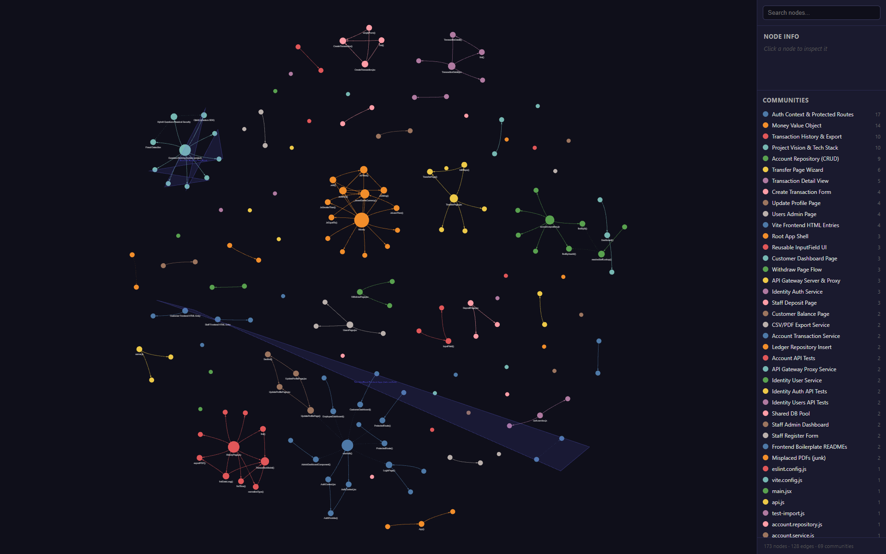

# Quantum Banking System

> A hybrid quantum-classical microservice banking platform that combines a
> production-style core ledger with **real IBM Quantum** primitives (QRNG,
> BB84 QKD, VQC fraud detection) and a full audited transaction lifecycle —
> built end-to-end as an academic project, but engineered to production
> standards.

[]()
[]()
[]()
[]()

---

## Table of Contents

1. [What this project is](#what-this-project-is)
2. [Architecture at a glance](#architecture-at-a-glance)
3. [Services](#services)
4. [Quantum components](#quantum-components)
5. [Security model](#security-model)
6. [Quick start](#quick-start)
7. [Configuration & secrets](#configuration--secrets)
8. [Production deployment (HTTPS)](#production-deployment-https)
9. [Running the test suites](#running-the-test-suites)
10. [API reference](#api-reference)
11. [Repository layout](#repository-layout)
12. [Phase-by-phase changelog](#phase-by-phase-changelog)
13. [Comparative analysis (classical vs. quantum)](#comparative-analysis-classical-vs-quantum)
14. [Code knowledge graph](#code-knowledge-graph)
15. [Troubleshooting](#troubleshooting)
16. [Contributing & licensing](#contributing--licensing)

> 👉 **New here?** A step-by-step end-to-end run-through (boot stack,
> create users, click through both UIs, exercise the quantum + fraud
> features) lives in [`docs/USAGE_GUIDE.md`](docs/USAGE_GUIDE.md).

---

## What this project is

The Quantum Banking System is a **hybrid quantum-classical banking platform**
built as a final-year engineering project. It is not a toy: every "core
banking" requirement (authentication, accounts, ledger, transfers,
double-entry bookkeeping, audit, idempotency, outbox-pattern eventing,
fraud detection, transaction cancellation with compensating entries) is
implemented as a real microservice talking over Kafka and HTTP. On top
of that, three **genuine quantum primitives** run against IBM Quantum's
real hardware (or local Aer simulators):

- **QRNG** — Quantum Random Number Generation, used to seed cryptographic
  operations in the KMS.
- **BB84 QKD** — Quantum Key Distribution simulation with eavesdropper
  detection visualization.
- **Quantum-ML fraud detection** — a Variational Quantum Classifier
  (`ZZFeatureMap` + `RealAmplitudes`) compared head-to-head with a
  classical logistic-regression baseline.

The system is delivered with two React frontends (customer + staff),
HTTPS via Caddy, centralized secret management, an OpenAPI gateway,
and a comparative analysis report for the academic deliverable §4.3.

---

## Architecture at a glance

```
                ┌──────────────────────────────────────────────────┐
                │      Caddy (TLS / HSTS / Let's Encrypt)          │
                └───────────────────────┬──────────────────────────┘
                                        │ :443
                                        ▼
                           ┌──────────────────────┐
                           │     api-gateway      │  Express, rate-limit
                           │      :3000           │  Redis-backed limiter
                           └──┬─────┬─────┬─────┬─┘
                              │     │     │     │
   ┌──────────────┬──────────┐│     │     │     │┌────────────┬────────────┐
   ▼              ▼          ▼▼     ▼     ▼     ▼▼            ▼            ▼
┌────────┐  ┌──────────┐  ┌─────────┐ ┌────────┐ ┌─────────┐ ┌────────┐ ┌──────────┐
│identity│  │ account  │  │ ledger  │ │quantum │ │  kms    │ │ fraud  │ │  audit   │
│ :3001  │  │  :3002   │  │  :3003  │ │ :3005  │ │  :3006  │ │ :3007  │ │  :3004   │
└───┬────┘  └────┬─────┘  └────┬────┘ └───┬────┘ └────┬────┘ └───┬────┘ └────┬─────┘
    │           │              │           │           │          │           │
    │  Postgres │  Postgres   │ Postgres   │           │          │   Postgres│
    │ identity_ │  account_   │ ledger_    │ IBM Q    │ Vault?    │ ML model │  audit_
    │   db      │    db       │   db       │ runtime  │ (in-mem)  │  bundles │    db
    │           │              │           │           │          │           │
    └─────────────────────────────┐                                            │
                                  ▼                                            │
                           ┌────────────┐                                      │
                           │  Kafka     │ ◄────── transaction.events ─────────┘
                           │  (Redpanda)│ ◄────── transaction.cancelled
                           │  + ZK      │ ◄────── fraud.alerts
                           └────────────┘
                                  ▲
                                  │ outbox-relay (5 s tick)
                                  │
                           ┌────────────┐
                           │   Redis    │ balance cache (TTL 60 s)
                           │  :6379     │ rate-limit store
                           └────────────┘
```

Key architectural choices:

- **Microservices** — eight independent Node.js / Python services, each with
  its own database. No shared schema, no shared writes.
- **Outbox pattern** — every Kafka event is written to an `event_outbox`
  table inside the same DB transaction as the ledger entry. A relay loop
  publishes asynchronously; recipients are guaranteed to see exactly the
  events that were committed.
- **Double-entry ledger** — every transfer creates one DEBIT and one CREDIT
  row in `ledger_entries`. Cancellations write **compensating entries**
  (never UPDATE / DELETE), preserving an immutable audit trail.
- **Decimal-safe money math** — `shared/money.js` wraps `decimal.js`.
  `Money.subtract()` throws on insufficient funds; rounding is fixed at
  4 decimal places.
- **Idempotency** — `cancelled_transactions(original_transaction_id PRIMARY KEY)`
  guarantees a transaction can be cancelled at most once.
- **Cache** — Phase 2.1 read-through cache on `/balance` (Redis, 60 s TTL),
  invalidated on every committed mutation via DEL + pub/sub.
- **Quantum + classical** — quantum primitives live in their own service
  and are accessed over HTTP, so the classical core can run unmodified.

---

## Services

| Service | Port | Stack | Responsibility |
|---|---|---|---|
| **api-gateway** | 3000 | Node 20, Express | OpenAPI gateway, Redis-backed rate-limit, request fan-out |
| **identity-service** | 3001 | Node 20, bcrypt, JWT | Customer / staff auth, refresh tokens, RBAC |
| **account-service** | 3002 | Node 20, pg, kafkajs | Accounts, balance, deposit/withdraw/transfer, cancellation |
| **ledger-service** | 3003 | Node 20, decimal.js | Read-side queries on `ledger_entries` |
| **audit-service** | 3004 | Node 20 | Append-only audit log of admin actions |
| **quantum-service** | 3005 | Python 3.11, Qiskit | QRNG, BB84 QKD, IBM Quantum runtime |
| **kms-service** | 3006 | Node 20 | In-memory key registry seeded by QRNG (Phase 3) |
| **fraud-service** | 3007 | Python 3.11, scikit-learn, Qiskit-ML | Real-time scoring, classical + VQC bundles |

### Frontends

| Folder | Stack | Audience |
|---|---|---|
| `customer_frontend/` | React + Vite + Tailwind | End-customer portal: balance, deposit, withdraw, transfer, history |
| `staff_frontend/` | React + Vite + Tailwind | Staff/admin portal: account admin, **fraud dashboard** (alerts feed, KPIs, one-click cancel), QKD visualizer |

---

## Quantum components

### QRNG (`/quantum/qrng`)

Sample bits from a true uniform superposition (`H` on each qubit, then
measure). Deployed against IBM's `ibm_brisbane` and `ibm_torino` backends
when `IBM_QUANTUM_TOKEN` is set, and falls back to `qiskit-aer` for local
simulation otherwise.

### BB84 (`/quantum/qkd/bb84`, `/quantum/qkd/visualize`)

Full BB84 protocol simulation:

1. Alice prepares qubits in random bases (`Z` / `X`).
2. (Optional) Eve intercepts and re-measures.
3. Bob measures in random bases.
4. Alice + Bob publicly compare bases and sift the key.
5. QBER (Quantum Bit Error Rate) on a sampled subset reveals Eve's presence.

The `/quantum/qkd/visualize` endpoint renders the actual `QuantumCircuit`
diagram. Two reference images are committed to the session store
(`bb84_circuit_no_eve.png`, `bb84_circuit_with_eve.png`).

### Variational Quantum Classifier (fraud detection)

- Encoder: `ZZFeatureMap` (4 qubits, 1 rep)
- Ansatz: `RealAmplitudes` (4 qubits, 3 reps)
- Optimizer: `COBYLA`, 60 iterations
- Pre-processing: `StandardScaler` → `PCA` (7 → 4 features)

Trained on a 300-sample subset of a 11 000-sample synthetic transaction
dataset (9 % positive class). Both bundles (`baseline-lr-v1`,
`vqc-zz-realamp-v1`) live under `services/fraud-service/models/`.

---

## Security model

- **JWT** with separate access / refresh tokens (Phase 0.1). Refresh tokens
  are stored hashed in `refresh_tokens` and revocable.
- **RBAC** — `customer`, `employee`, `admin` (extends `requireStaff` for the
  fraud dashboard and cancel endpoint).
- **Daily transfer cap** (Phase 0.3) — rolling 24 h window of DEBITs from
  source. Configurable via `DAILY_TRANSFER_LIMIT_TND` (default 10 000 TND).
- **Rate limiting** at the gateway, Redis-backed (cross-replica fair share).
- **Compensating cancellation** — admin can void a transaction. Original
  rows are preserved; reverse rows are inserted with `compensates =
  original_ledger_entry_id`. Idempotent on `original_transaction_id`.
- **Outbox pattern** — events are never published unless the matching
  ledger row committed.
- **TLS / HSTS** in production via Caddy (Phase 5.2).
- **Centralized secrets** (Phase 5.3) — every secret read from `.env`,
  no secrets in source. Sample template at `infrastructure/.env.example`.

> ⚠️ **Security note (historical):** an early Phase 3.5 commit accidentally
> committed a real IBM Quantum API token + CRN into `.env.example`. Those
> values have been removed but **still exist in git history** — they should
> be rotated at <https://quantum.ibm.com/account>.

---

## Quick start

### Prerequisites

- Docker Desktop ≥ 24 (Compose v2.24+ for the prod overlay's `!reset` syntax)
- (Optional) Node.js 20 + Python 3.11 if you want to run a service directly
- (Optional) IBM Quantum account for real hardware execution

### One-command boot

```bash
cd infrastructure
cp .env.example .env          # edit values as needed (or leave defaults for dev)
docker compose up -d --build
```

The stack starts Postgres (×6 logical DBs), Redpanda (Kafka), Redis, and all
eight services. First boot takes ~3 minutes (model bundles are baked into
the fraud-service image).

### Smoke test

```bash
# Gateway is up
curl http://localhost:3000/health

# Sample QRNG
curl http://localhost:3000/quantum/qrng?bits=64

# Customer login (default seed user from infrastructure/init-db/)
curl -X POST http://localhost:3000/auth/customer/login \
  -H "Content-Type: application/json" \
  -d '{"email":"alice@example.com","password":"Password123!"}'
```

Open the customer SPA at <http://localhost:5173> and the staff SPA at
<http://localhost:5174> (run `npm install && npm run dev` in each
frontend folder).

---

## Configuration & secrets

All configuration is environment-driven. The single source of truth is
[`infrastructure/.env.example`](infrastructure/.env.example).

| Variable | Default | Purpose |
|---|---|---|
| `JWT_SECRET` | `supersecret_change_in_prod` | HS256 signing key for access / refresh tokens |
| `DAILY_TRANSFER_LIMIT_TND` | `10000` | Rolling 24 h DEBIT cap per source account |
| `BALANCE_CACHE_TTL` | `60` | Redis TTL (seconds) on the `/balance` cache |
| `KAFKA_BROKERS` | `redpanda:9092` | Comma-separated Kafka bootstrap list |
| `REDIS_URL` | `redis://redis:6379` | Cache + rate-limit store |
| `KMS_KEY_TTL_SEC` | `3600` | TTL on QRNG-seeded keys |
| `IBM_QUANTUM_TOKEN` | _(unset)_ | Real IBM Q execution; omit for Aer sim |
| `IBM_QUANTUM_INSTANCE` | _(unset)_ | CRN of the IBM Cloud instance |
| `CADDY_DOMAIN` | `localhost` | TLS hostname (`localhost` ⇒ self-signed) |
| `CADDY_EMAIL` | _(unset)_ | ACME contact for Let's Encrypt |

`docker-compose.yml` uses `${VAR:-sensible_default}` substitution
throughout, so a freshly cloned repo boots with no `.env` at all.

---

## Production deployment (HTTPS)

```bash
cd infrastructure

# 1) Provide real values — domain, email, JWT secret, etc.
cp .env.example .env && $EDITOR .env

# 2) Bring up the prod overlay (drops api-gateway direct port; runs Caddy)
docker compose -f docker-compose.yml -f docker-compose.prod.yml up -d
```

The overlay:

- Starts **Caddy 2.8-alpine** on `:80`, `:443`, `:443/udp` (HTTP/3).
- **Removes** the api-gateway's direct host port via Compose's `!reset []`
  feature, so traffic must go through TLS.
- Uses [`Caddyfile`](infrastructure/Caddyfile): auto Let's Encrypt for any
  real domain, self-signed for `localhost`, HSTS + CSP-ish security
  headers, gzip / zstd, `/caddy-health` probe.

---

## Running the test suites

Every service ships with its own jest / pytest suite. From the repo root:

```bash
# Node services — unit + API tests with coverage
( cd services/account-service  && npm install && npm run test:coverage )
( cd services/identity-service && npm install && npm run test:coverage )
( cd services/ledger-service   && npm install && npm run test:coverage )
( cd services/api-gateway      && npm install && npm run test:coverage )

# Python service — unit tests inside the running container
docker exec infrastructure-fraud-service-1 pytest -q

# Comparative report (Phase 5.4)
docker exec -w /app infrastructure-fraud-service-1 python -m src.eval_compare
```

### Coverage status (Phase 5.1)

| Service | Statements | Branches | Tests |
|---|---|---|---|
| account-service | **66 %** | 61 % | 40 / 40 |
| identity-service | **67 %** | 62 % | 25 / 25 |
| ledger-service | **100 %** | 100 % | 13 / 13 |
| api-gateway | **62 %** | 87 % | 11 / 11 |

`coveragePathIgnorePatterns` excludes server bootstrap files and thin DB
wrappers (covered by integration tests, not unit tests).

---

## API reference

Interactive Swagger UI is served by the gateway at:

- **JSON spec:** <http://localhost:3000/docs.json>
- **Swagger UI:** <http://localhost:3000/docs>

Highlights:

| Endpoint | Auth | Purpose |
|---|---|---|
| `POST /auth/customer/login` | none | Customer login → access + refresh tokens |
| `POST /auth/staff/login` | none | Staff/admin login |
| `POST /auth/refresh` | refresh | Rotate access token |
| `GET  /balance` | customer | Read-through cached balance |
| `POST /transfer` | customer | Atomic transfer, daily-cap enforced |
| `POST /admin/deposit` | staff | Manual credit |
| `POST /admin/transactions/:id/cancel` | staff | Phase 4.4 — write compensating entries (idempotent) |
| `GET  /admin/fraud/alerts` | staff | Phase 4.5 — fraud alert feed |
| `GET  /quantum/qrng` | any | True quantum random bits |
| `POST /quantum/qkd/bb84` | any | Run BB84 with optional Eve |
| `GET  /quantum/qkd/visualize` | any | Render the BB84 circuit |

---

## Repository layout

```
quantum-banking-system/
├── services/
│   ├── api-gateway/          Express gateway, rate-limit, OpenAPI
│   ├── identity-service/     Auth, JWT, RBAC, refresh tokens
│   ├── account-service/      Accounts, transfers, ledger writes, outbox, cancel
│   ├── ledger-service/       Read-side queries on ledger_entries
│   ├── audit-service/        Append-only audit log
│   ├── quantum-service/      QRNG, BB84, IBM Quantum runtime (Python)
│   ├── kms-service/          QRNG-seeded key registry
│   └── fraud-service/        Classical + VQC fraud scoring (Python)
├── shared/                   Cross-service helpers (Money, db pool, Redis cache)
├── customer_frontend/        React SPA — end-customer portal
├── staff_frontend/           React SPA — staff/admin + fraud dashboard
├── infrastructure/
│   ├── docker-compose.yml          Dev / base stack
│   ├── docker-compose.prod.yml     Prod overlay (Caddy, no direct gw port)
│   ├── Caddyfile                   TLS / HSTS / reverse proxy
│   ├── .env.example                Authoritative secret/config template
│   └── init-db/                    Per-service Postgres bootstrap
├── docs/
│   └── comparative-analysis.md     Phase 5.4 academic deliverable
├── graphify-out/             Module dependency graphs (Phase 0.5 tooling)
├── ROADMAP.md                Phase plan (0 → 5)
├── CHANGELOG.md              Per-phase change history
├── development_plan.md       Original engineering plan
└── README.md                 (you are here)
```

---

## Phase-by-phase changelog

The full per-phase changelog lives in [`CHANGELOG.md`](CHANGELOG.md).
Top-level summary:

- **Phase 0** — Bootstrap, JWT auth, RBAC, daily transfer cap, OpenAPI/Swagger
  gateway, `graphify` static dependency graphs.
- **Phase 1** — Kafka (Redpanda) + transactional **outbox pattern** for
  exactly-the-events-we-committed delivery.
- **Phase 2** — Redis read-through cache on `/balance` with DEL + pub/sub
  invalidation.
- **Phase 3** — `quantum-service`: QRNG + BB84 (with Eve detection) +
  circuit visualization.
- **Phase 3.5** — Verified execution on real **IBM Quantum** hardware
  (`ibm_brisbane`, `ibm_torino`).
- **Phase 4** — `fraud-service`: classical LR baseline + Variational Quantum
  Classifier; real-time scoring; transaction-cancellation endpoint with
  compensating entries.
- **Phase 4.5** — Staff fraud dashboard (alerts feed, KPIs, one-click cancel).
- **Phase 5** — NFR hardening: ≥60 % test coverage across node services,
  HTTPS via Caddy, centralized secrets, comparative classical-vs-quantum
  report.

---

## Comparative analysis (classical vs. quantum)

Real numbers from a single container run, fresh seeded test set
(`seed=999`, 2 200 samples, 9 % positive, threshold 0.5):

| Model | Precision | Recall | F1 | ROC-AUC | Latency / sample |
|---|---|---|---|---|---|
| `baseline-lr-v1` (classical LR) | **1.000** | **1.000** | **1.000** | **1.000** | **0.135 ms** |
| `vqc-zz-realamp-v1` (quantum) | 0.090 | 0.500 | 0.153 | 0.485 | 3.875 ms |

The synthetic dataset is linearly separable, so logistic regression cracks
it. The 4-qubit / 1-rep VQC is deliberately under-resourced (PCA 7 → 4,
COBYLA-60, 300-sample train subset) to keep runtime tractable on real
hardware. The full discussion — why quantum loses *here* and what would
make it competitive — is in [`docs/comparative-analysis.md`](docs/comparative-analysis.md).

Reproduce with:

```bash
docker exec -w /app infrastructure-fraud-service-1 python -m src.eval_compare
```

---

## Code knowledge graph

The whole repository is indexed by [graphify](https://npm.im/graphify-mcp-tools)
into a navigable code graph: **173 nodes · 128 edges · 69 communities**
across 85 source files. The clusters map 1-to-1 onto the bounded
contexts (Money value object, quantum stack, transfer wizard, auth
routes, …).



- Interactive version: [`graphify-out/graph.html`](graphify-out/graph.html)
  (open locally — full-text search, click-to-inspect, community filter).
- Markdown summary: [`graphify-out/GRAPH_REPORT.md`](graphify-out/GRAPH_REPORT.md).
- How to regenerate the graph and re-shoot the PNG: [`docs/code-graph.md`](docs/code-graph.md).

---

## Troubleshooting

| Symptom | Likely cause | Fix |
|---|---|---|
| `Cannot find module '/shared/...'` when running jest on the host | shared/ deps not installed | `cd shared && npm install` |
| `EADDRINUSE :3000` during `npm test` for api-gateway | older `app.listen` ungated | already fixed in Phase 5.1 — pull latest |
| Caddy stuck on TLS challenge | `CADDY_DOMAIN` is a real domain but DNS doesn't resolve to host | set `CADDY_DOMAIN=localhost` for dev; use Cloudflare/Route53 in prod |
| `IBM Quantum: invalid credentials` | token expired or rotated | regenerate at <https://quantum.ibm.com/account>, update `.env`, restart `quantum-service` |
| Fraud bundles missing | image built before training | `docker compose up -d --build fraud-service` |
| `outbox relay: publish failed` | Kafka not ready | wait ~20 s after `docker compose up`; relay retries every 5 s |

---

## Contributing & licensing

This repository is an academic project. External contributions are not
solicited, but issues and discussions are welcome. The codebase is
distributed under an academic-use license — see the headers of individual
files for attribution.

If you're a reviewer or examiner: every claim in this README is backed by
either a test in `services/*/tests/`, a numeric report in
`docs/comparative-analysis.md`, or an explicit ROADMAP phase.

— **Quantum Banking System team**
