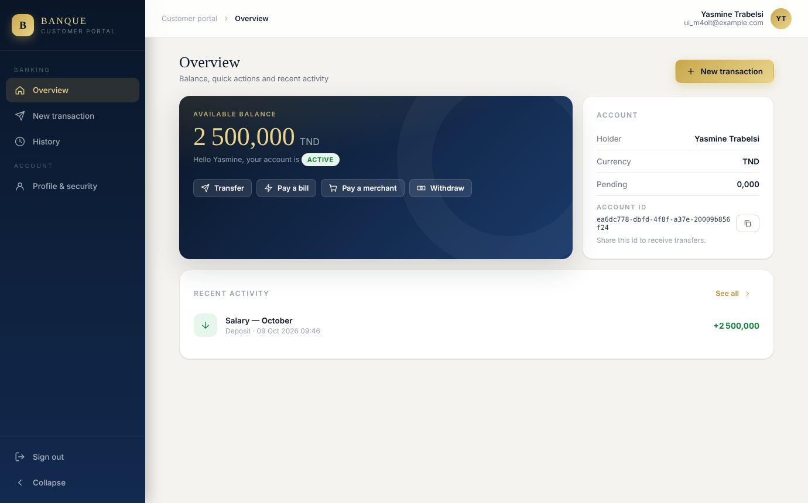
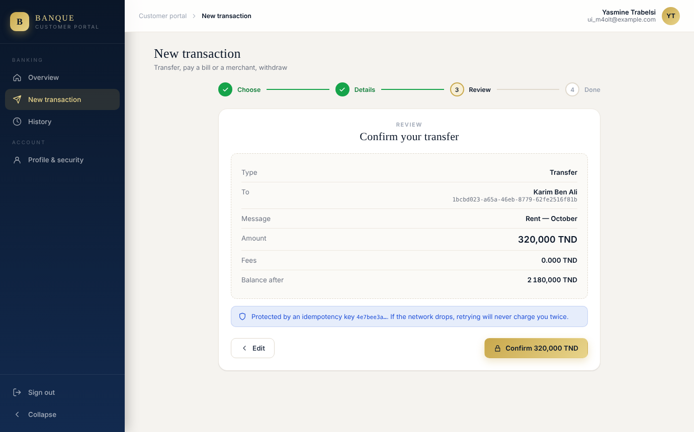
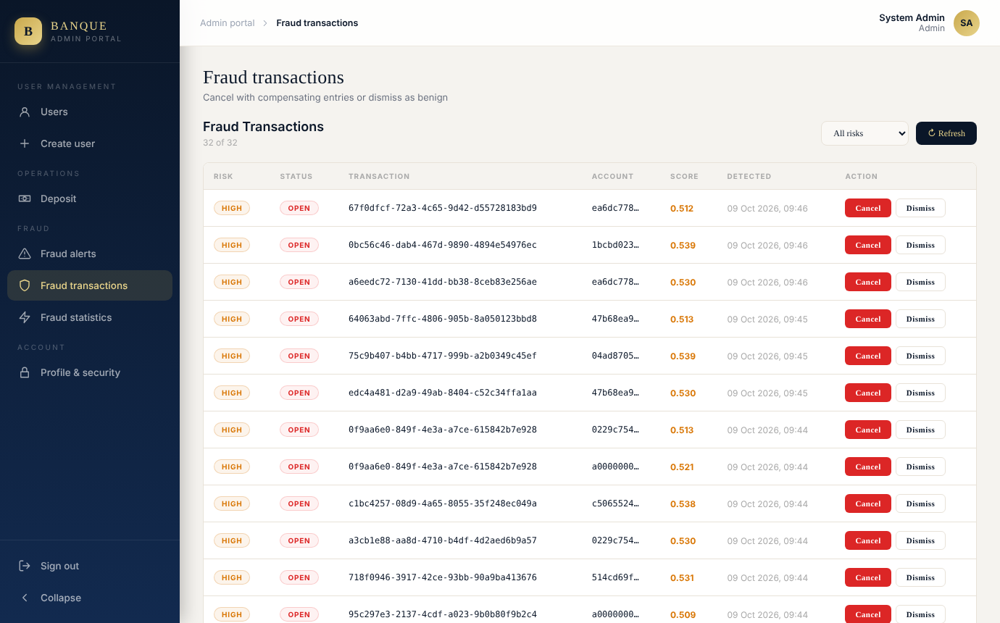

# Quantum Banking System

> A hybrid quantum-classical banking platform: a production-grade core
> ledger on **CockroachDB + Apache Kafka**, with **real IBM Quantum**
> primitives (QRNG, BB84 QKD, VQC fraud detection) and a fully audited,
> reversible transaction lifecycle. Built as a final-year engineering
> project, engineered to industrial standards.

[]()
[]()
[]()
[]()

---

## Table of contents

1. [What this project is](#what-this-project-is)
2. [Architecture](#architecture)
3. [Services](#services)
4. [Screenshots](#screenshots)
5. [Money path: how a transfer really commits](#money-path-how-a-transfer-really-commits)
5. [Security model](#security-model)
6. [Quantum components](#quantum-components)
7. [Quick start](#quick-start)
8. [Configuration](#configuration)
9. [Production deployment (HTTPS)](#production-deployment-https)
10. [Operations: health, reconciliation, migrations](#operations-health-reconciliation-migrations)
11. [Tests](#tests)
12. [API reference](#api-reference)
13. [Repository layout](#repository-layout)
14. [Phase history](#phase-history)
15. [Comparative analysis (classical vs quantum)](#comparative-analysis-classical-vs-quantum)
16. [Troubleshooting](#troubleshooting)

> New here? The end-to-end walkthrough is in [`docs/USAGE_GUIDE.md`](docs/USAGE_GUIDE.md).

---

## What this project is

The Quantum Banking System is a **PFE** (final-year engineering project,
Faculty of Sciences of Bizerte, University of Carthage) that asks one
research question: *where does quantum computing add value to banking
security today, and where does it not?*

To answer it honestly, the classical core is built the way a real bank
would build it, and three quantum primitives are attached at precise
points:

- **QRNG** — true randomness from Hadamard sampling, on Aer or IBM hardware.
- **BB84 QKD** — quantum key distribution with eavesdropper detection; the
  KMS turns accepted key bits into AES-256-GCM session keys.
- **Quantum ML** — a Variational Quantum Classifier scores every
  transaction next to a logistic-regression baseline, and the comparison
  is reported without spin ([`docs/comparative-analysis.md`](docs/comparative-analysis.md)).

Everything else is deliberately boring and correct: double-entry ledger,
one-transaction atomicity, transactional outbox, idempotent consumers,
compensating reversals, RBAC at the edge *and* in every service.

---

## Architecture

```
                 ┌───────────────────────────────────────────────┐
                 │   Caddy — TLS / HSTS / HTTP3 (prod overlay)   │
                 └──────────────────────┬────────────────────────┘
                                        │ :443
                                        ▼
                 ┌───────────────────────────────────────────────┐
                 │  api-gateway :3000                            │
                 │  helmet · CORS · JWT verify · RBAC gates      │
                 │  Redis rate-limit · request-id · OpenAPI      │
                 └──┬──────┬──────┬──────┬──────┬──────┬──────┬──┘
                    │      │      │      │      │      │      │
   ┌────────┐ ┌─────────┐ ┌────────┐ ┌───────┐ ┌───────┐ ┌─────┐ ┌───────┐
   │identity│ │ account │ │ ledger │ │ audit │ │quantum│ │ kms │ │ fraud │
   │ :3001  │ │  :3002  │ │ :3003  │ │ :3004 │ │ :3005 │ │:3006│ │ :3007 │
   └───┬────┘ └────┬────┘ └───┬────┘ └───┬───┘ └───┬───┘ └──┬──┘ └───┬───┘
       │           │          │          │         │ IBM Q  │ Redis  │
       ▼           ▼          ▼          ▼         ▼        ▼        ▼
   ┌──────────────────────────────────────────┐          ┌──────────────┐
   │ CockroachDB (one cluster, 5 databases)   │          │ Redis        │
   │ identity_db · account_db · ledger_db     │          │ cache · RL   │
   │ audit_db · fraud_db                      │          │ keys · pubsub│
   └──────────────────────────────────────────┘          └──────────────┘
                     ▲  outbox relay (SKIP LOCKED, idempotent producer)
                     │
   ┌─────────────────┴────────────────────────────────────────────────┐
   │ Apache Kafka (KRaft)  transaction.events · transaction.cancelled │
   │                        transaction.scored                        │
   └──────────────────────────────────────────────────────────────────┘
```

**Why CockroachDB.** It is one distributed SQL cluster. The five logical
databases keep bounded contexts separate, yet a single SQL transaction can
write `account_db.public.accounts` *and* `ledger_db.public.ledger_entries`
*and* `ledger_db.public.event_outbox` together. That is what makes the
money path atomic without a saga.

**Why Kafka with an outbox.** Events are inserted in the same transaction
as the ledger rows, then relayed by a loop that claims rows with
`FOR UPDATE SKIP LOCKED` and publishes with an idempotent producer. Every
consumer upserts on a composite key, so at-least-once delivery becomes
effectively-exactly-once rows.

---

## Services

| Service | Port | Stack | Responsibility |
|---|---|---|---|
| **api-gateway** | 3000 | Node 20, Express, helmet | Edge auth (JWT + RBAC), Redis rate-limit, request-id, OpenAPI, readiness fan-out |
| **identity-service** | 3001 | Node 20, bcrypt(12), JWT | Users, login per portal, rotating refresh tokens with reuse detection, suspension |
| **account-service** | 3002 | Node 20, pg, kafkajs | Accounts, deposit / withdraw / transfer / cancel, outbox relay, CSV + statement export |
| **ledger-service** | 3003 | Node 20 | Staff read-side on the append-only ledger, **balance reconciliation** |
| **audit-service** | 3004 | Node 20, kafkajs | Consumes both topics, append-only audit log keyed on (tx, account, event) |
| **quantum-service** | 3005 | Python 3.11, Qiskit | QRNG, BB84, circuit rendering; Aer or IBM runtime |
| **kms-service** | 3006 | Node 20 | BB84-derived AES-256-GCM keys in Redis, read-once, staff-only |
| **fraud-service** | 3007 | Python 3.11, scikit-learn, Qiskit ML | Scores every event with LR + VQC, raises / closes alerts |
| `shared/` | — | Node | `money` (decimal.js), `db` (pool + retrying transactions), `auth`, `errors`, `cache`, `logger` |

### Frontends

| Folder | Stack | Audience |
|---|---|---|
| `customer_frontend/` | React 19 + Vite | Overview with quick actions, **4-step New Transaction wizard** (transfer with recipient check, bill, merchant, withdraw) with idempotent submit, history, statement export, detail, profile, password |
| `staff_frontend/` | React 19 + Vite + antd | Same design system: user admin, deposits, **fraud dashboard** (alerts, KPIs, cancel, dismiss) |

Both SPAs share one design system (`src/styles/theme.css`, inline SVG icons,
`src/components/ui`): navy + gold on cream, serif display type, tabular
numerals, and a stepper, receipt and alert vocabulary used consistently.

---

## Screenshots

Captured by `make e2e-ui` against the live stack (more in [`docs/screenshots/`](docs/screenshots/)).

| Customer overview | New transaction — review | Staff fraud dashboard |
|---|---|---|
|  |  |  |

---

## Money path: how a transfer really commits

```
POST /transfer  ──►  gateway verifies JWT  ──►  account-service
                                                  │
   withTransaction(pool)  ─ BEGIN ─────────────────┤
     lock both accounts FOR UPDATE (sorted ids)    │  no lock-order deadlock
     owner check: source.user_id == jwt.userId     │  unless staff
     currency match, ACTIVE status                 │
     rolling-24h TRANSFER-debit cap (under lock)   │
     Money.subtract / add (decimal, 4 dp)          │
     INSERT ledger DEBIT + CREDIT (tx_type=TRANSFER)
     UPDATE both cached balances                   │
     INSERT 2 outbox rows                          │
   COMMIT ─────────────────────────────────────────┘  retried on 40001
   invalidate Redis balance cache for both users (best effort)
   outbox relay ──► Kafka ──► audit-service, fraud-service
```

**Unified `POST /transactions`.** One endpoint drives the customer wizard:
`kind` is `TRANSFER`, `BILL_PAYMENT`, `MERCHANT_PAYMENT` or `WITHDRAW`.
Billers and merchants come from the `payees` registry, each with its own
settlement account, so a bill payment is still a double-entry transfer with
`tx_type = BILL_PAYMENT`. An `Idempotency-Key` header is claimed inside the
same transaction as the money movement: a retry replays the stored response
with `replayed: true`, a concurrent duplicate gets `409`, and nothing can
ever be charged twice.

Cancellation (`POST /admin/transactions/:id/cancel`) runs the same way:
it never updates or deletes the original rows. It inserts one reverse
row per leg tagged `compensates = <original row id>`, registers the
cancellation (idempotent primary key), enqueues `transaction.cancelled`,
and the fraud-service closes the matching alert asynchronously. A
reversal that would overdraw an account fails cleanly with
`REVERSAL_INSUFFICIENT_FUNDS` and nothing is written.

---

## Security model

- **Edge authentication.** The gateway verifies every token before
  proxying; only `/health`, `/ready`, `/docs*` and the four `/auth/*`
  entry points are public. `/admin/*`, `/fraud/*`, `/kms/*`, `/ledger/*`
  and `/audit/*` require a staff role. Each service verifies again.
- **RBAC.** `admin` > `employee` > `customer`. Unknown roles are rejected
  with 401. Internal service calls use a 60-second `system` token.
- **Ownership.** Customers can only debit their own account; withdraw and
  history are keyed on the token, never on request bodies.
- **Tokens.** 15-minute access tokens; 7-day refresh tokens stored as
  SHA-256 hashes, rotated on every refresh, chain revoked on reuse.
  Suspended users cannot log in or refresh.
- **Rate limiting.** Redis-backed, shared across replicas: 20 login
  attempts / 15 min / IP, 300 API requests / min / IP. `X-Forwarded-For`
  is trusted only when `TRUST_PROXY=true` (set by the prod overlay).
- **Input hardening.** Decimal-string amounts validated by `Money`,
  bounded by `MAX_TX_AMOUNT`; JSON bodies capped at 64 kB; statement
  export escapes HTML and neutralises CSV formula injection.
- **Transport.** Caddy terminates TLS with HSTS, HTTP/2 and HTTP/3; no
  internal port is published in the prod overlay.
- **Secrets.** Everything comes from `infrastructure/.env`. A service
  started with `NODE_ENV=production` and the default `JWT_SECRET` refuses
  to boot.

> ⚠️ **Historical note.** A Phase 3.5 commit put a real IBM Quantum token
> and CRN into `.env.example`. The values were removed from the file but
> remain in git history. Rotate them at <https://quantum.ibm.com/account>
> before any public release.

---

## Quantum components

### QRNG — `GET /quantum/qrng?bytes=N`
Hadamard gates on 16 qubits (64 on IBM hardware), measured in batches
into a 4 KiB buffer. Falls back to Aer, then to `secrets`, and tags the
response `source` accordingly so callers can audit.

### BB84 — `POST /quantum/qkd/bb84`, `GET /quantum/qkd/visualize`
Full intercept-resend simulation: random bases, optional Eve, public
sifting, QBER estimate on a sample, abort above the threshold (default
11 %), majority vote across rounds. The KMS mints 256-bit AES keys from
accepted rounds. Reference circuit diagrams live in [`docs/quantum/`](docs/quantum/).

### Variational Quantum Classifier — fraud scoring
`ZZFeatureMap(4 qubits)` + `RealAmplitudes` + COBYLA, trained on a
stratified 300-sample subset after `StandardScaler → PCA(7→4)`. Scores run
beside a logistic-regression baseline; the decision policy is a weighted
blend (`0.7 × classical + 0.3 × quantum`, `FRAUD_QUANTUM_WEIGHT`) so an
uninformative VQC cannot flood the alert feed while a confident one can
still escalate a borderline case. Model bundles persist on the `fraud_models`
volume and train automatically on first boot.

---

## Quick start

### Prerequisites

- Docker Desktop ≥ 4.30 (Compose v2.24+ for the prod overlay's `!reset`)
- Node 20 and Python 3.11 only if you want to run tests or the frontends on the host

### One-command boot

```bash
cd infrastructure
cp .env.example .env            # defaults are fine for dev
docker compose up -d --build    # ~3-5 min first time; fraud-service trains the VQC
docker compose ps               # wait for everything to be (healthy)
```

### Smoke test

```bash
curl -s http://localhost:3000/health
curl -s http://localhost:3000/ready            # upstream fan-out

# Login as the seeded admin (change this password after first login)
TOKEN=$(curl -s -X POST http://localhost:3000/auth/staff/login \
  -H 'Content-Type: application/json' \
  -d '{"username":"adminn","password":"admin123"}' | jq -r .token)

curl -s "http://localhost:3000/quantum/qrng?bytes=16" -H "Authorization: Bearer $TOKEN"
curl -s http://localhost:3000/fraud/stats          -H "Authorization: Bearer $TOKEN"
```

Frontends run on the host: `npm install && npm run dev` in
`customer_frontend/` (<http://localhost:5173>) and `staff_frontend/`
(<http://localhost:5174>).

---

## Configuration

Single source of truth: [`infrastructure/.env.example`](infrastructure/.env.example).

| Variable | Default | Purpose |
|---|---|---|
| `JWT_SECRET` / `JWT_REFRESH_SECRET` | dev defaults | HS256 keys; must be set in production |
| `JWT_EXPIRES` / `JWT_REFRESH_EXPIRES` | `15m` / `7d` | Token lifetimes |
| `BCRYPT_ROUNDS` | `12` | Password hashing cost |
| `DB_HOST`, `DB_PORT`, `DB_USER`, `DB_PASSWORD`, `DB_SSL` | insecure single node | CockroachDB connection |
| `DAILY_TRANSFER_LIMIT_TND` | `10000` | Rolling 24 h cap on outgoing TRANSFER debits |
| `MAX_TX_AMOUNT` | `1000000` | Hard cap on any single amount |
| `BALANCE_CACHE_TTL` | `60` | Redis TTL on `/balance` |
| `OUTBOX_POLL_MS` / `OUTBOX_BATCH` | `500` / `100` | Relay cadence and batch size |
| `AUTH_RL_MAX` / `API_RL_MAX` | `20` / `300` | Rate limits per IP |
| `TRUST_PROXY` | `false` | Trust `X-Forwarded-For` (prod overlay sets `true`) |
| `CORS_ORIGIN` | both Vite dev URLs | Allowed browser origins |
| `KEY_TTL_SEC`, `KEY_ROUNDS`, `KEY_QUBITS` | `300`, `3`, `1024` | KMS key material |
| `QUANTUM_BACKEND` | `simulator` | `ibm` for real hardware |
| `IBM_QUANTUM_TOKEN`, `IBM_QUANTUM_CRN` | unset | Required when backend is `ibm` |
| `CADDY_DOMAIN`, `CADDY_EMAIL` | `localhost` | TLS hostname and ACME contact |
| `LOG_LEVEL` | `info` | JSON log verbosity |

---

## Production deployment (HTTPS)

```bash
cd infrastructure
cp .env.example .env && $EDITOR .env    # real JWT secrets, domain, email
docker compose -f docker-compose.yml -f docker-compose.prod.yml up -d --build
```

The overlay adds Caddy on 80/443, removes every internal host port,
enables `TRUST_PROXY`, and applies CPU/memory limits per service. Use
`CADDY_DOMAIN=localhost` for a self-signed local certificate.

---

## Operations: health, reconciliation, migrations

| Need | How |
|---|---|
| Liveness / readiness | every service: `/health`; gateway, account, identity, ledger, audit, fraud: `/ready` |
| Upstream map | `GET /ready` on the gateway returns per-service status |
| Outbox backlog | `GET /admin/outbox/stats` → `{PENDING, SENT, FAILED}` |
| Balance drift | `GET /ledger/accounts/:id/reconcile` recomputes from the ledger and reports `drift` and `consistent` |
| Transaction integrity | `GET /ledger/transactions/:txId` returns every leg and `balanced` |
| Audit trail | `GET /audit/stats`, `GET /audit/recent?accountId=` |
| Schema upgrade of an existing cluster | `make db-migrate` (applies `scripts/migrations/*.sql`) |
| Structured logs | JSON lines with `service`, `level`, request `id`; rotate via Docker json-file options |

---

## Tests

```bash
make test        # every suite on the host
```

| Package | Suites | Tests | Covers |
|---|---|---|---|
| shared | 1 | 25 | Money arithmetic, rounding, currency guards |
| account-service | 8 | 84 | Atomic deposit / withdraw / transfer, ownership, daily cap, 40001 retry, cancellation, export escaping, route status mapping |
| identity-service | 3 | 30 | Login per portal, suspension, refresh, validation, provisioning, admin CRUD |
| ledger-service | 2 | 16 | Append-only contract, reconciliation, auth gates |
| api-gateway | 1 | 26 | Edge auth, role gates, header forwarding, raw passthrough, 502/504 mapping |
| fraud-service | 2 | 13 | Feature math, risk policy, JWT decorator |

CI runs all six, lints and builds both frontends, validates both compose
files and builds every image.

### End-to-end verification (live stack)

```bash
make e2e-api     # 72 checks through the gateway: auth, RBAC, deposits, transfers,
                 # payments, idempotency, limits, export, reconciliation, audit,
                 # cancellation, fraud, QRNG, BB84, KMS, refresh rotation, suspension
make e2e-ui      # Playwright drives both portals (login → wizard → history → detail,
                 # staff deposit → fraud dashboard) and writes screenshots to scripts/e2e/shots
```

Both scripts were run against CockroachDB v24.1, Apache Kafka 3.7 and Redis 7
with every service live; the counts in this README come from that run.

---

## API reference

Interactive Swagger UI at <http://localhost:3000/docs>, JSON at `/docs.json`.

| Endpoint | Role | Purpose |
|---|---|---|
| `POST /auth/customer/login`, `/auth/staff/login` | public | Tokens (rate-limited) |
| `POST /auth/refresh`, `/auth/logout` | public | Rotate / revoke refresh token |
| `GET /auth/me`, `PUT /auth/me`, `PUT /auth/password` | any | Profile and password |
| `GET /balance` | any | Cached balance |
| `GET /accounts/verify/:id` | any | Recipient check (name, currency, status only) |
| `GET /transactions`, `/transactions/:id`, `/transactions/export` | any | Own history, detail, CSV / statement |
| `POST /transactions` | any | Unified create: transfer, bill, merchant, withdraw (idempotent) |
| `GET /payees` | any | Billers and merchants |
| `POST /transfer`, `POST /withdraw` | any | Legacy single-purpose endpoints (still supported) |
| `GET /quantum/*` , `POST /quantum/qkd/bb84` | any | Quantum demos |
| `POST /admin/deposit` | staff | Credit any account |
| `GET /admin/accounts/:id[/transactions]` | staff | Lookup by id, username or email |
| `POST /admin/transactions/:id/cancel` | staff | Compensating reversal |
| `GET /admin/outbox/stats` | staff | Relay health |
| `GET /ledger/accounts/:id/reconcile` | staff | Ledger vs cached balance |
| `GET /fraud/alerts`, `/fraud/stats`, `/fraud/model-info` | staff | Fraud dashboard |
| `POST /fraud/alerts/:id/dismiss`, `POST /fraud/score` | staff | Alert triage, ad-hoc scoring |
| `POST /kms/keys`, `GET /kms/keys/:kid` | staff | BB84-derived keys, read-once |
| `GET /audit/stats`, `/audit/recent` | staff | Audit log |
| `/admin/users*` | admin | User management |

Errors are always `{ ok: false, code, message }` with stable codes such as
`FORBIDDEN`, `INSUFFICIENT_FUNDS`, `DAILY_LIMIT_EXCEEDED`, `ALREADY_CANCELLED`.

---

## Repository layout

```
quantum-banking-system/
├── services/
│   ├── api-gateway/        edge auth, rate-limit, OpenAPI, proxies
│   ├── identity-service/   users, JWT, refresh rotation
│   ├── account-service/    money path, outbox relay, export
│   ├── ledger-service/     read-side + reconciliation
│   ├── audit-service/      Kafka → audit_logs
│   ├── quantum-service/    QRNG, BB84, viz (Python)
│   ├── kms-service/        BB84-derived keys
│   └── fraud-service/      LR + VQC scoring, alerts (Python)
├── shared/                 money, db, auth, errors, cache, logger (+ tests)
├── customer_frontend/      React SPA
├── staff_frontend/         React SPA (fraud dashboard)
├── infrastructure/
│   ├── docker-compose.yml        base stack with healthchecks
│   ├── docker-compose.dev.yml    hot reload overlay
│   ├── docker-compose.prod.yml   Caddy TLS, no internal ports, limits
│   ├── Caddyfile
│   └── .env.example
├── scripts/
│   ├── init-db.sql               fresh-cluster schema
│   ├── migrations/               upgrades for existing clusters
│   └── loadtest/                 concurrent deposits (node + k6)
├── docs/                   usage guide, comparative analysis, quantum diagrams, code graph
├── ROADMAP.md · CHANGELOG.md · development_plan.md
└── Makefile
```

---

## Phase history

- **Phase 0** — JWT + refresh tokens, decimal money, daily cap, rate-limit, OpenAPI.
- **Phase 1** — Kafka (KRaft) + transactional outbox + audit-service.
- **Phase 2** — Redis read-through cache, distributed rate limiter.
- **Phase 3 / 3.5** — quantum-service (QRNG, BB84, viz), KMS, verified on IBM hardware.
- **Phase 4 / 4.5** — fraud-service (LR + VQC), cancellation with compensating entries, staff fraud dashboard.
- **Phase 5** — coverage ≥ 60 %, Caddy HTTPS, centralized secrets, comparative report.
- **Phase 6 — Industrial hardening** — single-transaction money path, edge
  authentication and RBAC for every route, ownership checks, locked
  withdraws, composite audit/fraud keys, cancellation-aware fraud alerts,
  reconciliation API, SKIP LOCKED relay with idempotent producer, 4-dp
  money everywhere, healthchecks and resource limits, full CI matrix.
  Details in [`CHANGELOG.md`](CHANGELOG.md).

---

## Comparative analysis (classical vs quantum)

Held-out test set (`seed=999`, 2 200 samples, 9 % positive, threshold 0.5):

| Model | Precision | Recall | F1 | ROC-AUC | Latency / sample |
|---|---|---|---|---|---|
| `baseline-lr-v1` | **1.000** | **1.000** | **1.000** | **1.000** | **0.135 ms** |
| `vqc-zz-realamp-v1` | 0.090 | 0.500 | 0.153 | 0.485 | 3.875 ms |

The synthetic data is linearly separable, so logistic regression wins
outright; the 4-qubit VQC is deliberately under-resourced to stay
trainable on CPU. The full discussion, including what would make the
quantum model competitive, is in [`docs/comparative-analysis.md`](docs/comparative-analysis.md).
Reproduce with `docker exec -w /app qbs-fraud-service-1 python -m src.eval_compare`.

---

## Troubleshooting

| Symptom | Cause | Fix |
|---|---|---|
| `401` on `/quantum/*` | Phase 6 requires a token on every non-auth route | Log in first, send `Authorization: Bearer` |
| `403 FORBIDDEN` on `/transfer` | Source account is not the caller's | Use your own `accountNumber` from `/balance`; staff may transfer for anyone |
| `Cannot find module '/shared/...'` on the host | tests resolve `/shared` through jest mappers only | run `npm test` in the package, or `ln -s $PWD/shared /shared` |
| `JWT_SECRET must be set in production` | default secret with `NODE_ENV=production` | set a real secret in `.env` |
| fraud-service unhealthy for minutes after first boot | VQC training | wait for `VQC ready` in logs; bundles persist on the `fraud_models` volume |
| `REVERSAL_INSUFFICIENT_FUNDS` on cancel | recipient already spent the funds | business decision; nothing was written |
| Old cluster, new code | schema predates Phase 6 | `make db-migrate` |
| Caddy stuck on TLS challenge | domain does not resolve to this host | `CADDY_DOMAIN=localhost` for local TLS |

---

*Academic project — Quantum Banking System team. Every claim above is
backed by a test under `services/*/tests` or `shared/tests`, or by the
numeric report in `docs/comparative-analysis.md`.*
